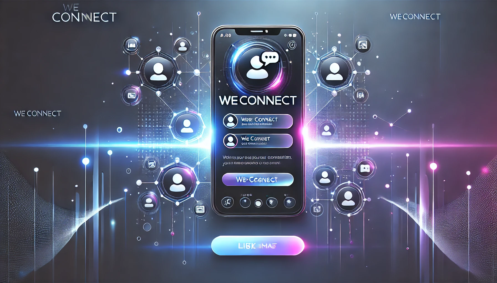

# WECCONECT
# 📱 MyApp - Real-Time Mobile Experience 🚀



## 🌟 Overview  
**WECONNECT** is a real-time mobile application designed to deliver seamless communication and data synchronization using **Socket.IO, MongoDB, Firebase, and React Native**.

## ⚡ Features  
✅ **Real-time Messaging** with WebSockets (Socket.IO)  
✅ **Cloud Storage & Authentication** via Firebase  
✅ **NoSQL Database** with MongoDB for scalability  
✅ **Push Notifications** for instant updates  
✅ **Beautiful UI/UX** built with React Native  

## 🛠️ Tech Stack  
- **Frontend:** React Native (Expo)  
- **Backend:** Node.js, Express  
- **Real-time Communication:** Socket.IO  
- **Database:** MongoDB (Mongoose ORM)  
- **Authentication & Storage:** Firebase  

## 📸 Screenshots  
| Home Screen | Chat Screen | Profile Page |
|-------------|------------|--------------|
|  |  |  |

## 🚀 Installation  
### **1️⃣ Clone the Repository**  
```sh
git clone https://github.com/yourusername/MyApp.git
cd MyApp
